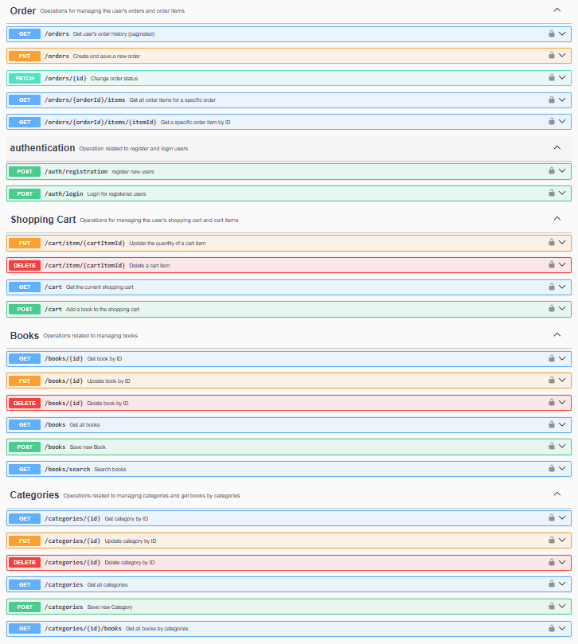

# 📚 Book Store

A simple yet powerful **Spring Boot REST API** for managing books and categories.

This project was inspired by the need to build a clean, well-structured backend application that demonstrates real-world
practices such as database migrations, integration testing, and containerization. It solves the problem of managing a
book catalog with categories in a scalable and maintainable way.

---

## 👤 About the Author

👨‍💻 GitHub: [YuraYurchuk](https://github.com/YuraYurchuk)

---

## 🧰 Technologies & Tools

The project is built using modern Java backend technologies:

- **Java 17**
- **Spring Boot**
- **Spring MVC**
- **Spring Data JPA**
- **Spring Security**
- **Liquibase**
- **MySQL**
- **JUnit 5**
- **Testcontainers**
- **Docker & Docker Compose**
- **Maven**
- **Swagger (OpenAPI)**

---

## 📍 Endpoints

The application follows a RESTful architecture and exposes the following main controllers and endpoints.

### 🔐 AuthenticationController

Responsible for user authentication and authorization using JWT.

- **POST** `/auth/registration` — Register a new user (default role: USER)
- **POST** `/auth/login` — Authenticate user and receive JWT token

---

### 📖 BookController

Manages books in the store.

- **POST** `/books` — Create a new book (ADMIN only)
- **GET** `/books` — Get a list of all available books
- **GET** `/books/{id}` — Get a book by its ID
- **PUT** `/books/{id}` — Update a book by ID (ADMIN only)
- **DELETE** `/books/{id}` — Soft delete a book by ID (ADMIN only)
- **GET** `/books/search` — Search books by parameters:
    - title
    - author
    - ISBN

---

### 📂 CategoryController

Manages book categories.

- **POST** `/categories` — Create a new category (ADMIN only)
- **GET** `/categories` — Get all categories
- **GET** `/categories/{id}` — Get category by ID
- **PUT** `/categories/{id}` — Update category by ID (ADMIN only)
- **DELETE** `/categories/{id}` — Soft delete category by ID (ADMIN only)
- **GET** `/categories/{id}/books` — Get all books belonging to a category

---

### 🛒 ShoppingCartController

Handles shopping cart operations for users.

- **POST** `/cart` — Add a book to the shopping cart
- **GET** `/cart` — View all items in the shopping cart
- **PUT** `/cart/items/{id}` — Update quantity of a cart item
- **DELETE** `/cart/{id}` — Remove an item from the shopping cart

---

### 📦 OrderController

Manages user orders.

- **POST** `/orders` — Create a new order
- **GET** `/orders` — Get all orders
- **GET** `/orders/{id}` — Get order details by ID
- **GET** `/orders/{orderId}/items/{itemId}` — Get a specific item from an order
- **PATCH** `/orders/{id}` — Update order status (ADMIN only)

---

## 🗂 Project Structure


---

## 📌 API Documentation

Swagger UI is available after running the application:

http://localhost:8080/swagger-ui.html



It provides a full overview of all available endpoints and request/response models.

---

## 📥 How to Clone and Run the Project

Follow these steps to clone the project from GitHub and run it on your local machine.

---

### 1️⃣ Clone the Repository

Open your terminal or command prompt and run:

```bash
git clone https://github.com/YuraYurchuk/book-store.git
cd book-store   
```

### 2️⃣ Prerequisites

## 🛠 Prerequisites

Make sure you have the following tools installed on your system:

- **Java JDK 17** or higher
- **Maven**
- **MySQL**

You can verify the installation by running:

```bash
java --version
mvn --version
mysql --version
```

### 3️⃣ Configure the Database

Update database credentials in the file: src/main/resources/application.properties

Example configuration:

```configuration
spring.datasource.url=jdbc:mysql://localhost:3306/book_shop?serverTimezone=UTC
spring.datasource.username=root
spring.datasource.password=your_password
```

Liquibase migrations will be applied automatically on application startup.

### #️⃣ Build and Run the Application

```bash
mvn clean package
mvn spring-boot:run
```

---
https://github.com/YuraYurchuk/book-store

Feel free to fork the project or use it as a foundation for your own backend applications 🚀